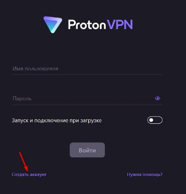
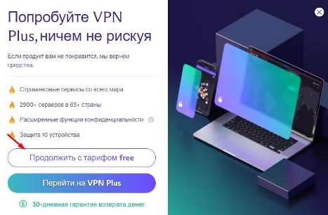
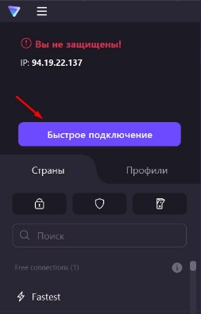

**Как бесплатно скачать и установить приложение ProtonVPN на Windows 10, 11** Чтобы установить ProtonVPN на ваш компьютер:

1. Перейдите на сайт <https://protonvpn.com/ru/download> и скачайте установочный файл.

2. Откройте папку **Загрузки** и запустите программу установки ProtonVPN\_v3.2.2.exe.
2. Следуйте инструкциям по установке на экране.
2. Запустите приложение ProtonVPN.
2. Выберите **Создать аккаунт**.

6. В открывшемся окне браузера нажмите кнопку **Получить Proton Free**.

7. Нажмите кнопку **Продолжить с тарифом Free**.

8. Создайте аккаунт.
8. Вернитесь в окно приложения ProtonVPN и войдите в аккаунт.
10. Нажмите кнопку **Быстрое подключение** и дождитесь подключения к доступной сети.

11. Убедитесь, что вы подключены к VPN: перейдите на сайт <https://ru.linkedin.com/>.

Готово — теперь ваш компьютер подключен к ProtonVPN.
