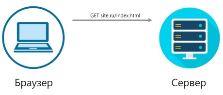
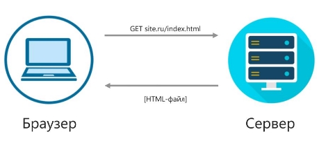

Что такое cookies

Когда вы заходите на какой-либо сайт, веб-сервер передает браузеру вашего устройства небольшой фрагмент текстовых данных — ***cookies***. Cookies позволяет запомнить информацию о вас, в том числе, историю ваших просмотров и активности на сайте.

Как это работает?

Для передачи данных между браузером и веб-сервером служит ***протокол HTTP***, который действует по системе запрос-ответ. Сначала браузер запрашивает у сервера веб-страницу:

Сервер, в свою очередь, отвечает на запрос и направляет файл HTML (веб-страницу):

Таким образом, клиент (браузер) получает доступ к веб-странице.

Представим, что пользователю нужно проверить свои входящие письма. Для этого он заходит на электронную почту и посылает запрос серверу. Чтобы «пропустить» пользователя, сервер запрашивает данные авторизации (обычно, логин и пароль). Пользователь вводит свои данные, сервер принимает верный пароль, и клиент снова запрашивает свои входящие письма. Однако, ему придется авторизоваться снова, ведь протокол HTTP не позволяет серверу запоминать и хранить информацию, т. е. является протоколом без состояния (***stateless)***.

Эту проблему решают cookies — небольшие фрагменты данных о пользователе. Приняв верный пароль, сервер отправляет браузеру cookies с помощью HTTP-заголовков, а браузер их сохраняет, чтобы использовать при последующих запросах к серверу. Прочитав cookies, сервер определяет, что данный пользователь уже авторизован и предоставляет ему доступ к веб-странице.

Сервер может хранить данные множества пользователей, но cookies у каждого свои. Если вместо cookies браузер передаст пустой файл или некорректную информацию, то сервер «не узнает» пользователя снова.

Файлы cookies хранятся не только на сервере, но и в браузере, чтобы пользователь имел автоматический доступ к различным ресурсам без необходимости авторизоваться каждый раз.

Таким образом, ***cookies*** – это небольшие фрагменты данных, в которых сохраняется информация о пользователе.

Зачем нужны cookies?

Cookies отслеживают всю вашу интернет-деятельность — они хранят в памяти данные авторизации, товары из корзины интернет-магазина, а также помогают компаниям создавать таргетированную рекламу. Представьте, что вам приглянулись туфли в интернет-магазине, но вы их не купили. Файлы cookies сохраняют информацию о ваших действиях и передают ее рекламодателям. На следующий день на своей странице в социальной сети вы видите рекламу именно той пары туфель, которую вы искали, — все благодаря cookies.

Cookies можно удалить из браузера, чтобы оптимизировать его работу и очистить с сайтов информацию о вашем посещении в целях конфиденциальности. Удаление cookies может также решить проблемы с загрузкой и отображением веб-страниц.

Как удалить cookies в браузере Google Chrome

Чтобы удалить все cookies:

1. Откройте Google Chrome и нажмите на значок с тремя точками в правом углу экрана.
1. Выберите **Дополнительные инструменты → Удаление данных о просмотренных страницах**.
1. Перейдите в **Основные настройки** в окне **Очистить историю**.
1. Выберите **Все время** в меню **Временной диапазон**.
1. Выберите **Файлы cookie и другие данные сайтов**.
1. Нажмите **Удалить данные**.

Готово - все файлы cookies удалены из браузера.
