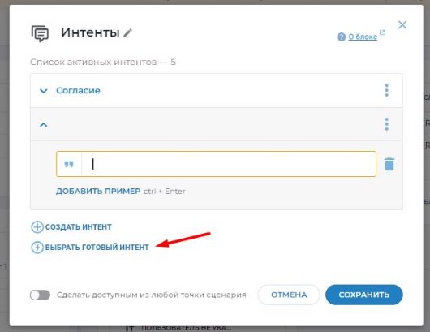
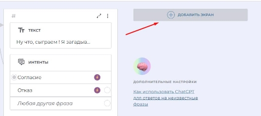
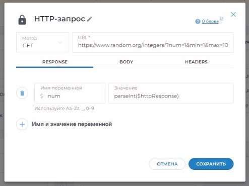
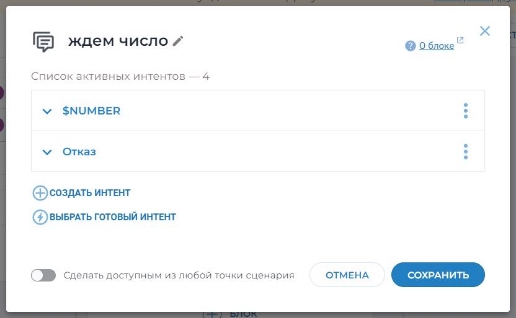
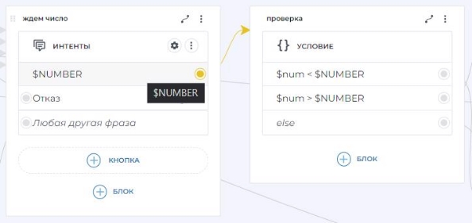

Создаем чат-бот в Aimylogic

Этот урок поможет вам создать игровой чат-бот в Aimylogic. Бот будет загадывать случайное число и предлагать пользователю угадать его.

Перед тем, как начать разрабатывать чат-бот, выполните следующие действия:

1. Зарегистрируйтесь на платформе [Aimylogic](https://app.aimylogic.com/).
1. Нажмите **Чат-боты** в верхней панели слева.
1. Нажмите **Создать бота → В конструкторе**.
1. Заполните основные настройки: **Язык общения — Русский, Шаблон бота — Пустой шаблон**.
1. Укажите название проекта — «Игровой чат-бот» — и нажмите **В конструктор**.

Готово — откроется конструктор бота. Начнем создавать чат-бот.

Шаг 0. Сценарий

Уточним условия игры. Бот загадывает случайное число от 1 до 100, а пользователь его угадывает. Если указанное пользователем число неверно, то бот должен сообщить, больше или меньше его секретное число, и предложить пользователю угадать еще раз. Игра продолжается до того момента, когда пользователь угадает число.

Чтобы реализовать игру, необходимо создать сценарий. Он состоит из экранов, а экраны состоят из блоков.

Пример экрана:

Пример отдельного блока внутри экрана:

Экраны можно перемещать и располагать, как удобно. Чтобы переместить экран, наведите мышь на левый верхний угол экрана до появления значка , потяните и поместите экран на нужное место.

Наш сценарий будет состоять из 10 экранов. В процессе создания сценария мы будем давать имена всем экранам, чтобы было легче ориентироваться в диалоге.

Шаг 1. Условия игры

На первом экране бот объяснит пользователю условия игры.

1. Выберите блок **Текст** в разделе **Блоки.**

2. Введите реплику бота: *«Ну что, сыграем ! Я загадываю число, а ты угадываешь! Начнём?».* Нажмите **Сохранить**.

3. Добавим реплику пользователя о согласии участвовать в игре. Выберите **+БЛОК** → **Согласие.**

4. Добавим реплику пользователя об отказе участвовать в игре. Нажмите два раза на появившийся блок **Интенты** и нажмите кнопку **Выбрать готовый интент** в том же окне**.**

5. Выберите **Отказ** и нажмите кнопку **Выбрать**.

6. Нажмите **Сохранить**.
6. Дадим название этому экрану. Для этого нажмите на значок карандаша в левом верхнем углу экрана и введите название «Начало».

Экран с условиями игры готов. Вот, что получилось:

Шаг 2. Пока (пользователь отказался играть)

Есть два варианта развития событий: пользователь может согласиться или отказаться продолжать игру.

Добавим экран, где пользователь сможет завершить диалог с чат-ботом и выйти из игры.

1. Наведите курсор мыши на пустую область справа от первого экрана и нажмите **Добавить экран**.

2. Выберите блок **Текст.**
3. Введите реплику бота: *«Хорошо. До скорого!».*
3. Нажмите **Сохранить**.
3. Добавьте блок **Завершение сценария** из подменю **Действия** на том же экране**,** чтобы бот закончил диалог с пользователем.

6. Назовите этот экран «Пока».

Что получилось:

Шаг 3. Запрос (бот загадывает число)

Создадим экран для продолжения диалога, где бот загадает число. Так как бот не может выдать число сам, обратимся к сайту random.org, который генерирует случайные числа. Бот сможет получить от этого сайта число с помощью HTTP-запроса.

1. Добавьте новый экран с блоком **HTTP-запрос** из подменю **Действия**.
1. Выберите тип запроса GET (установлен по умолчанию).
1. Укажите [данную](https://www.random.org/integers/?num=1&min=1&max=100&col=1&base=10&format=plain&rnd=new) ссылку в поле URL. Если перейти по ссылке, сайт выдает случайное число от 1 до 100.
1. Чтобы бог мог обработать ответ на запрос, ему необходимо сохранить полученное число в некоторую переменную. Для этого во вкладке RESPONSE добавьте **Имя** «num» и **Значение переменной** «parseInt($httpResponse)».

parseInt($httpResponse) — это формула, полученная при соединении parseInt (одна из функций Javascript) и $httpResponse (системная переменная, в которую бот сохранил ответ, полученный от random.org).

5. Назовите этот экран «Запрос» и нажмите **Сохранить.**

Получился такой экран:

Шаг 4. Связываем реплики

Теперь необходимо связать между собой готовые реплики (экраны), чтобы действия бота были логичны и последовательны.

После того, как пользователь согласится сыграть, бот должен загадать число. Но если пользователь откажется играть, боту необходимо завершить диалог.

Чтобы связать соответствующие экраны:

1. Наведите курсор мыши на кружок у интента **Согласие.** Зажмите кнопку мыши и протяните стрелку к экрану с HTTP-запросом.

2. Наведите курсор мыши на кружок у интента **Отказ** и протяните стрелку к экрану с завершением сценария.

![ref1]

Готово — теперь бот продолжит/завершит диалог в зависимости от желания пользователя.

Шаг 5. Я загадал

Сигнализируем пользователю, что бот загадал число.

1. Добавьте экран с блоком **Текст.**
1. Введите реплику «*Итак, я загадал число от 1 до 100! Попробуй его отгадать*». Нажмите **Сохранить**.
1. Добавьте блок **Переход** (подменю Действия) на тот же экран**.** Это необходимо, чтобы бот направил пользователя к следующему этапу.
1. Назовите этот экран «Я загадал».

Теперь пользователь знает, что бот загадал число. Что получилось:

Шаг 6. Успешно или ошибка

Построим логические связи с экраном «Запрос» (см.Шаг 3).

1. Если HTTP-запрос **Завершен успешно,** соедините этот вариант с экраном «Я загадал».

![ref1]

2. Если HTTP-запрос **Завершен с ошибкой**, проведите стрелку к тому же самому экрану с HTTP-запросом, чтобы бот загадал число заново.

Готово — бот загадал число, пользователь может продолжать игру.

Шаг 7. Ждем число

Теперь пользователь должен начать угадывать — ему необходимо ввести число.

1. От блока **Переход** (на экране «Я загадал») создайте новый экран с блоком **Интенты**.
1. Выберите **Сделать свой интент** и укажите следующую переменную: $NUMBER. С помощью этой переменной бот будет принимать числа от пользователя.
1. Добавьте опцию отказа от игры на случай, если пользователь не будет продолжать диалог. Нажмите **Выбрать готовый интент** и выберите **Отказ.**
1. Нажмите **Выбрать** и **Сохранить**.
5. Назовите этот экран «Ждем число».

6. Соедините интент **Отказ** с экраном «Пока» для логичного завершения диалога.

Шаг 8. Не указал

Допустим, что пользователь указал число, не входящее в диапазон 1–100, или не указал ничего. Напомним ему условия игры и предложим остановить диалог, если необходимо.

1. Создайте экран с блоком **Текст** и напишите: *«Укажи число от 1 до 10 или напиши Нет, чтобы остановить игру»*. Нажмите **Сохранить**.
1. Добавьте блок с действием **Переход** на этот же экран.
1. Соедините **Переход** с экраном «Ждем число», чтобы направить пользователя на предыдущий шаг.
1. Назовите этот экран «Не указал».
5. Соедините опцию **Любая другая фраза** (добавилась автоматически на экран «Ждем число») с экраном «Не указал». Это необходимо, чтобы перенаправить пользователя к шагу, где нужно указать число.

Что получилось:

Шаг 9. Проверка

Теперь бот должен проверить, что пользователь ввел число от 1 до 100. Создадим для этого новый экран.

1. Нажмите на интент **$NUMBER** в блоке «Ждем число» и создайте блок **Условия**. Есть два варианта развития событий:
   1) указанное пользователем число меньше, чем загаданное ботом число;
   1) указанное пользователем число больше, чем загаданное ботом число.
   1) пользователь угадал число.
1. Укажите *$num < $NUMBER* в поле «Javascript-выражение». Это условие варианта 1), где num — загаданное ботом число, а NUMBER — указанное пользователем число.
3. Добавьте условие *$num > $NUMBER.* Это условие варианта 2).
3. Нажмите **Сохранить.**

На экран автоматически добавилось условие **else** для варианта 3), если пользователь угадает число сразу.

Назовем этот экран «Проверка». Вот, что получилось:

Шаг 10. Результат

После того, как бот проверит число, он должен сообщить пользователю результат. Напишем ответы бота и построим между ними логические связи.

1. «Мое число больше».
- Создайте новый экран с блоком **Текст** и введите: *«Нет! Мое число больше, чем $NUMBER! Попробуй еще раз»*.
- Добавьте блок **Переход** и соедините его с экраном «Ждем число», чтобы дать пользователю возможность угадать еще раз.
- Назовите этот экран «Мое число больше» и нажмите **Сохранить**.
- Соедините условие $num > $NUMBER (экран «Проверка») с экраном «Мое число больше».
2. «Мое число меньше».
- Создайте еще один экран с блоком **Текст** и введите: *«Нет! Мое число меньше, чем $NUMBER! Попробуй еще раз»*.
- Добавьте блок **Переход** и соедините его с экраном «Ждем число».
- Назовите этот экран «Мое число меньше» и нажмите **Сохранить**.
- Соедините условие $num < $NUMBER (экран «Проверка») с экраном «Мое число меньше».
3. «Угадал».
- Создайте новый экран с блоком **Текст** и введите: *«Да, это было число $num! Поздравляю! ».*
- Добавьте блок **Завершение сценария**.
- Назовите этот экран «Угадал» и нажмите **Сохранить**.
- Соедините условие else (экран «Проверка») с экраном «Угадал».

Готово. Всего получится три экрана с ответами бота:

Шаг 11. Тестируем чат-бот

Поздравляем, вы разработали чат-бот!

Теперь чат-бот нужно протестировать, чтобы проверить его работу.

1. Нажмите **Тестировать** в верхней части экрана. Откроется тестовый виджет диалога с ботом.

2. Поиграйте с ботом — отвечайте на его реплики разными способами, чтобы увидеть его ответы.
2. Чтобы запустить новую сессию, нажмите на значок ⟳в верхнем правом углу тестового виджета.
2. Чтобы начать тест заново, нажмите на этот значок:

5. Нажмите **Остановить тестирование**, если готовы завершить тест.

 

Итак, наш чат-бот готов к работе!

В этом уроке мы научились создавать чат-бот с игрой, где пользователю нужно угадать загаданное ботом число.

[ref1]: Aspose.Words.06b5cd6b-a20e-4285-a008-91dfc92faa2b.017.png
